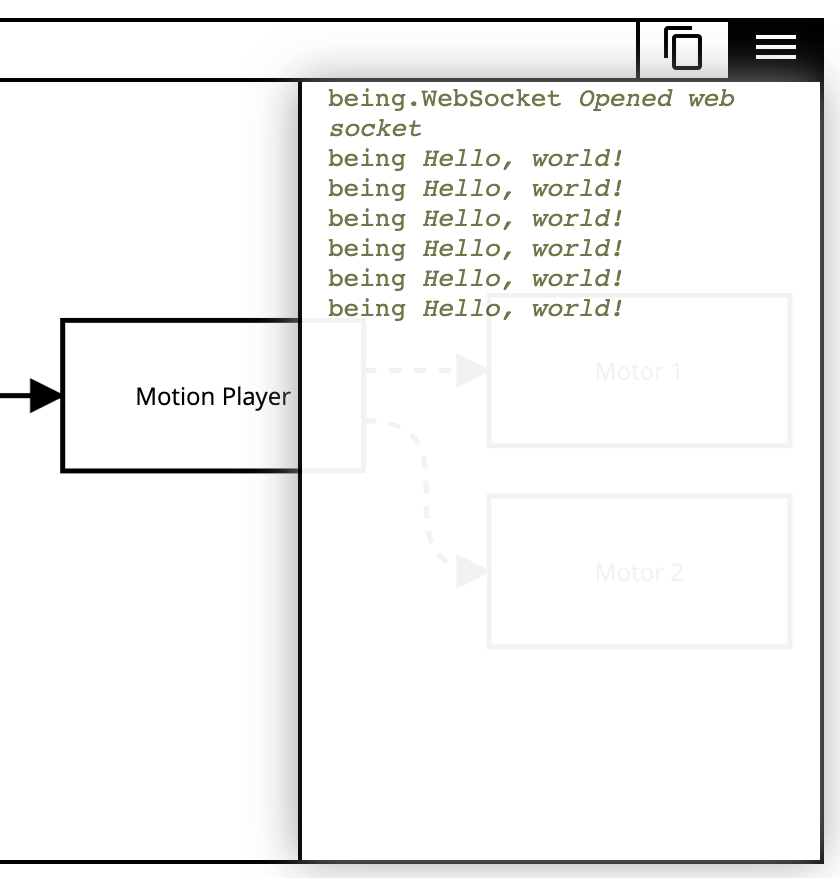

components/control_panel
========================

Control panel widget.

Block network graph and console.

.. image:: ../images/control\ panel\ widget.png
   :align: center
   :alt: Control panel widget screenshot.

Submodules
----------

components/control_panel/block_diagram
--------------------------------------

Block diagram functionality for control panel. Relies on the third-party
library `elkjs <https://github.com/kieler/elkjs>`_. Renders being block
diagram to the :class:`components/control_panel/control_panel.ControlPanel`
widget.

.. js:autofunction:: block_diagram.draw_block_diagram

components/control_panel/console
--------------------------------

Console functionality for control panel.

.. js:autoclass:: Console
   :members:

components/control_panel/control_panel
--------------------------------------

Control panel widget web component.

.. js:autoclass:: ControlPanel
   :members:

