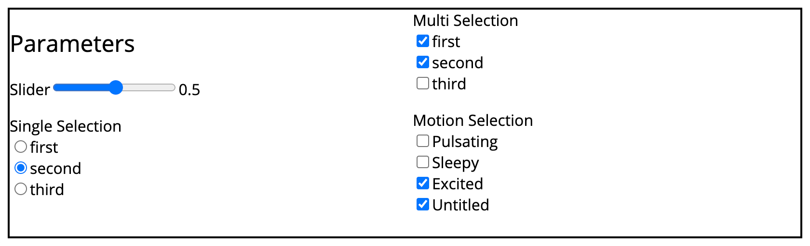

components/params_panel
=======================

Parameter panel widget.

   Parameter panel with 4x different parameters: Slider, single selection,
   multi selection and content related motion curve selection.

This widget only shows up if there are actual `Param Blocks` in the being
program.

Submodules
----------

components/params_panel/components
----------------------------------

Parameter components.

HTML elements equivalents for the different `Param Blocks` in the backend.

These are small web components wrapping HTML input elements. Each param
represents a single parameter value.

.. js:autoclass:: Slider
   :members:

.. js:autoclass:: SingleSelection
   :members:

.. js:autoclass:: MultiSelection
   :members:

.. js:autoclass:: MotionSelection
   :members:

components/params_panel/params_panel
------------------------------------

.. js:autoclass:: ParamsPanel
   :members:

