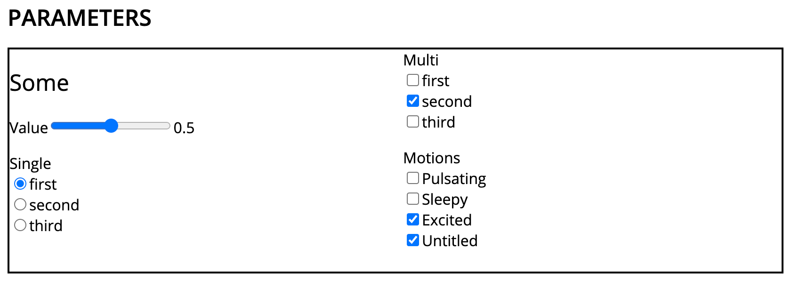

Concepts
========

Blocks and Connections
----------------------

Blocks are the main building *blocks* in being (pun intended). Each block
encapsulates certain functionalities and can pass data to its connected
neighbors.

.. digraph:: someblocks
   :align: center
   :alt: Some connected blocks.
   :caption: Some connected blocks.
   :name: Some connected blocks.

   node [shape=box];
   rankdir="LR"

   A -> B;
   B -> C [style=dashed];
   B -> C [style=dashed];

There are two kind of connections:

- *Value* (⇢) connections are intended for continuous streams of data. Think
  audio samples or motor position values. Accessed via the ``value``
  attributes.
- *Message* (→) connections ``send`` and ``receive`` discrete messages.

Outputs and inputs can be connected with each other with the ``connect``
method. It is possible to connect one output to many inputs but not the other
way round (different outputs to one single input).

.. digraph:: manyinputs
   :align: center
   :alt: Output with many inputs.
   :caption: Output with many inputs.
   :name: Output with many inputs.

   rankdir="LR"

   a[label="Input"];
   b[label="Input"];
   c[label="Input"];

   Output -> a;
   Output -> b;
   Output -> c;

Data can be passed around with the ``value`` attribute and the
``send`` / ``receive`` methods.

.. code-block:: python

   from being.connectables import ValueOutput, ValueInput, MessageOutput, MessageInput

   valueOut = ValueOutput()
   valueIn = ValueInput()
   valueOut.connect(valueIn)

   valueOut.value = 42
   print(valueIn.value)  # Prints 42

   msgOut = MessageOutput()
   msgIn = MessageInput()
   msgOut.connect(msgIn)

   msgOut.send('Hello, world!')
   for msg in msgIn.receive():
       print(msg)  # Prints 'Hello, world!'

A small summary of the block attributes:

- :attr:`being.block.Block.inputs`: Input connectables.
- :attr:`being.block.Block.outputs`: Output connectables.
- :attr:`being.block.Block.input`: First / primary input connectable.
- :attr:`being.block.Block.output`: First /primary output connectable.

The pipe operator ``|`` can be used to chain multiple blocks via their primary
inputs and outputs

.. code-block:: python

   # Pipe operator for 3x blocks
   a | b | c

   # Is equivalanet to:
   # >>> a.output.connect(b.input)
   # ... b.output.connect(c.input)

Block Network and Execution Order
---------------------------------

The blocks together with the connections form a *block network*. This is a
directed graph and forms the core of every being program. Given such a block
network being will try to find a suitable *execution order* of these blocks and
tick every block once per cycle by calling its :meth:`being.block.Block.update`
method.

.. digraph:: cycle
    :align: center
    :alt: Directed graph with cycle
    :caption: Directed graph with cycle
    :name: Directed graph with cycle

    node [shape=box];
    bgcolor="#ffffff00"
    A -> B -> C;
    B -> D;
    D -> B;
    {rank = same; A; B; C;}

Resulting execution order is *[A, B, C, D]* although *C* and *D* could be
swapped depending on the insertion order.

.. code-block:: python

   from being.block import Block
   from being.execution import determine_execution_order

   class Foo(Block):

       """Example block printing and passing on messages."""

       def __init__(self):
           super().__init__()
           self.add_message_input()
           self.add_message_output()

       def update(self):
           for msg in self.input.receive():
               first, *rest = msg
               print(first)
               self.output.send(rest)

   # Initializing blocks
   a = Foo()
   b = Foo()
   c = Foo()

   # Making the connections
   a | b | c

   # Determining the execution order. One initial block of the network
   # suffices (vertex discovery)
   execOrder = determine_execution_order([b])

   # Executing a single cycle with some data
   a.input.push(['Hello', 'world', '!'])
   for block in execOrder:
       block.update()

This will output

.. code-block:: bash

   Hello
   world
   !

When running a being block network with the :func:`being.awakening.awake`
function the execution order will be executed indefinitely. The interval
duration is taken from :mod:`being.configuration`.

Configs and Parameters
----------------------

In order to add new possible user input on the fly being has so called
*Parameter Blocks*. Each of these blocks outputs a value and appears in the UI
as widget with which the value can be changed. The state of these parameter
blocks gets mirrored in a config file on disk so that the parameter stay
persistent between subsequent runs.

.. code-block:: python

   """Parameter block demo."""
   from being.awakening import awake
   from being.block import Block
   from being.params import Slider, SingleSelection, MultiSelection, MotionSelection

   block = Block()

   # Creating new ad-hoc value inputs and connecting them the parameter blocks
   Slider('Some/Value') | block.add_value_input()
   SingleSelection('Some/Single', ['first', 'second', 'third']) | block.add_value_input()
   MultiSelection('Some/Multi', ['first', 'second', 'third']) | block.add_value_input()
   MotionSelection('Motions') | block.add_value_input()

   awake(block)

In the UI this looks like this:

   Parameter panel

And the ``being_params.yaml`` config file

.. code-block:: yaml

   Some:
     Value: 0.5
     Single: first
     Multi:
     - second
   Motions:
   - Excited
   - Untitled

JSON, INI and TOML are also supported although INI is not suited for the usage
with parameters blocks (no support for nested mappings and datatypes).

Serialization
-------------

JSON serialization of the different being object is defined in
:mod:`being.serialization`. Custom types get mapped to and from dictionary
representation which can be converted to JSON strings.

This conversion is taken care by :func:`being.serialization.dumps` and
:func:`being.serialization.loads`.

.. digraph:: jsonserialization
   :align: center
   :alt: JSON serialization of being objects.
   :caption: JSON serialization of being objects.
   :name: JSON serialization of being objects.

   rankdir="LR"
   Object -> JSON [label="dumps()"];
   JSON -> Object [label="loads()"];

It is also possible to serialize named tuples and enums. But these types have
to be registered after creation
(:func:`being.serialization.register_named_tuple` and
:func:`being.serialization.register_enum`).

.. code-block:: python

   from typing import NamedTuple
   from being.serialization import register_named_tuple, dumps

   class Foo(NamedTuple):
      first: str = 'hello'
      second: int = 42

   register_named_tuple(Foo)
   foo = Foo(second=1234)
   print(dumps(foo))
   # {"type": "Foo", "first": "hello", "second": 1234}

Web UI and API
--------------

When running a Being program a web based user interface gets started up. This
allows the user to interact with the system in real-time. Depending on the used
blocks some HTML templating is involved for generating the single page. But for
the most part communication between front- and backend takes place over a HTTP
based API and a web socket connection to exchange asynchronous messages and
updates. Everything web related can be found in the :mod:`being.web` package
together with the static files and the JavaScript code.

The frontend is grouped in different *widgets*. Each widget is its own web `Web
Components <https://developer.mozilla.org/en-US/docs/Web/Web_Components>`_.
Most widgets will fetch some initial data and then receive subsequent updates
via the web socket connection.

Networking
----------

Basic network functionality is implemented in the
:class:`being.networking.NetworkOut` and :class:`being.networking.NetworkIn`
blocks. These blocks send and receive being messages as UDP datagrams. This
makes it possible to split a being program over multiple computers. The message
types must be serializable by being. Use standard Python types like a
dictionary or register your custom types with the being serialization system.

Resources
---------

System resources have limited availability and need to be released when the
program shuts down. In the context of being this refers to the CAN interface
and network sockets. These resources are handled by a global
:class:`contextlib.ExitStack` in :mod:`being.resources`.

When resources are acquired at run-time it is important to use the
:func:`being.resources.manage_resources` context manager so that the collected
resources can be released at the end.

.. code-block:: python

   from being.networking import NetworkIn
   from being.resources import manage_resources

   with manage_resources():
      # Creates and binds a socket internally
      incoming = NetworkIn(address=('', 56790))

   # Socket gets released here

The same logic applies to the CAN interface, RPi GPIO, port audio backend...

Single Instance Cache
---------------------

For comfort, some types get instantiated implicitly when needed. For example,
when creating a :class:`being.motors.blocks.CanMotor` block, by default a
:class:`being.backend.CanBackend` instance gets created as well. Similarly
every :class:`being.motion_player.MotionPlayer` block needs a
:class:`being.clock.Clock` and a :class:`being.content.Content` instance.

The :class:`being.utils.SingleInstanceCache` base class caches all these
instances. These de-facto global variables are an anti-pattern but opposed to
the classical singleton pattern single instantiation is not enforced and these
single instances are only used as *default* values. All classes, which make use
of single instances, also accept them via their initialize method (dependency
injection).

.. code-block:: python

   from being.utils import SingleInstanceCache

   class Foo(SingleInstanceCache):
       def __init__(self):
           print('Foo gets initialized')

   print('Initialized:', Foo.single_instance_initialized())  # Initialized: False
   a = Foo.single_instance_setdefault()  # Foo gets initialized
   b = Foo.single_instance_setdefault()
   print('a is b:', a is b)  # a is b: True

Splines
-------

Splines are special mathematical functions. They are used to interpolate
between values.

.. math::

   S: [a,b]\to \mathbb{R}^n

Being deals exclusively with *piecewise polynomial parametric curves*. This is
a chain of multiple segments where each segment is a cubic polynomial spline in
the Bernstein basis. Below is a plot with a scalar spline made out of two
segments.

.. plot::

   import matplotlib.pyplot as plt
   from scipy.interpolate import BPoly
   from being.plotting import plot_spline_2

   # Polynomial coefficient matrix
   c = [[0, 2], [0, 2], [2, 1], [2, 1]]

   # Knots or breakpoints
   x = [0, 1, 3]

   spline = BPoly(c, x)

   plot_spline_2(spline)
   plt.xlabel('Time')
   plt.ylabel('Position')
   plt.show()

The shape ``(k, m, ...)`` of the coefficient matrix ``c`` controls the nature
of the spline and its output format. ``k`` is the *spline order* and ``m`` the
number of segments or intervals. Concerning the output values:

- shape ``(k, m)``: Scalar spline outputs ``1.234``.
- shape ``(k, m, 1)``: One dimensional spline outputs ``[1.234]``.
- shape ``(k, m, 3)``: Three dimensional spline outputs ``[1.234, 1.234, 1.234]``.

.. note::

   Because of convience scalar splines are represented as one dimensional
   splines in being.

Curves
------

A :class:`being.curve.Curve` is a container for splines. Each *motion curve*
has multiple individual splines. These are independent and do not share any
break points or coefficients. Each of these splines defines a motion channel
which can be routed to motors. A curve should have at least one spline.

.. plot::

   import numpy as np
   import matplotlib.pyplot as plt
   from scipy.interpolate import BPoly

   from being.curve import Curve

   first = BPoly([[[0], [1]], [[0], [1]], [[1], [0]], [[1], [0]] ], [0, 1, 3])
   second = BPoly([[[1]], [[1]], [[0]], [[0]]], [0, 2])

   curve = Curve([first, second])
   t = np.linspace(0, 3, 100)
   plt.plot(t, curve(t, extrapolate=False))
   plt.xlabel('Time')
   plt.ylabel('Position')
   plt.show()

Content
-------

A :class:`being.content.Content` instance manages all user defined motion
curves inside a directory. Curves are saved as JSON files in this folder.

Motion Player
-------------

The :class:`being.motion_player.MotionPlayer` block plays motion curves on the
motors. It accepts *motion commands* messages as instructions for which curve
to schedule next. Curves are loaded from the content directory, sampled and
outputted via the position outputs
(:attr:`being.motion_player.MotionPlayer.positionOutputs`).

.. digraph:: motionplayer
   :align: center
   :alt: Motion Player steering multiple motors
   :caption: Motion Player steering multiple motors
   :name: Motion Player steering multiple motors

   rankdir="LR"
   dummy [label="", shape=none, height=0, width=0]
   MP [shape=box, label="Motion Player"];
   A [shape=box, label="Motor 1"];
   B [shape=box, label="Motor 2"];
   C [shape=box, label="Motor 3"];

   dummy -> MP [label="Motion Command"]
   MP -> A [style=dashed, label="Target Position"]
   MP -> B [style=dashed]
   MP -> C [style=dashed]

.. note::

   The reason for the additional `positionOutputs` attribute is, that at some
   point it was planed to add feedback connection to notify when a motion curve
   had been played succefully or not. `outputs` would then have an addional
   entry.

Motors
------

A motor block accepts *target position* and outputs *actual position* values.

.. digraph:: motorblock
   :align: center
   :alt: Motor block input and output values.
   :caption: Motor block input and output values.
   :name: Motor block input and output values.

   rankdir="LR"
   in[shape=none, label=""]
   motor[label="Motor Block", shape=box]
   out[shape=none, label=""]
   in -> motor [label="Target Position"]
   motor -> out [label="Actual Position"]

Motor blocks come in different flavors, depending on the physical configuration
(linear vs. Rotary motors, different rotary motor variations). All of these are
represented by the different classes in :mod:`being.motors.blocks`.

Since many motors have relative encoders they need to be *homed* after turning
them on so that they can orient them self and find their initial position.

.. _CiA 402: https://www.can-cia.org/can-knowledge/canopen/cia402/

Motor blocks can be *enabled* or *disabled*. This corresponds to the *Operation
Enabled* and *Ready to Switch On* states of the `CiA 402`_ State Machine.

By default, CAN motors are run in the *Cyclic Synchronous Position (CSP)*
operation mode. Every cycle a new target position value is send to the motor
via PDO.  Trajectory generation is mostly done on the application side.  Note
although, that this is handled very differently between the different vendors.
It is also possible to run motor blocks in the *Profiled Position* mode. In
this case, the target position input is ignored. Instead the motor block
accepts :class:`being.motors.definitions.PositionProfile` messages which will
be relayed to the motor.

Settings
^^^^^^^^

The *CanMotors* have a *settings* argument which can be used to apply custom
configurations to the motor. Settings are a dictionary with address to value
mappings. The address can also be a string with slashes (``/`` path syntax). In
this case the *EDS object dictionary* is used to resolve the target address.
Path parts can also be integer numbers (decimal, hexadecimal, ...)

.. note::

   Most motors are sensitive to the order in which settings are applied.
   Therefore using a :class:`collections.OrderedDict` is advised.

State Switching
^^^^^^^^^^^^^^^

For switching to an arbitrary target state the `CiA 402`_ State Machine needs
to be traversed in the right way. What complicates things is that this can take
an arbitrary amount of time. Two methods exists in the
:class:`being.cia_402.CiA402Node` CanOpen remote node:

- :meth:`being.cia_402.CiA402Node.change_state`: Blocking with a timeout. This
  is *not* suited for live operation since everything else will be blocked
  including PDO communication and Sync messages (NMT operational).
- :meth:`being.cia_402.CiA402Node.state_switching_job`: Creates a Python
  Generator which handles the state traversal.  Responsibility for ticking the
  Generator is with the caller. Kind of a pseudo *coroutine* which makes it
  possible to interlace multiple state switchings with the normal operation.

A small example for the latter

.. code-block:: python

   """This example illustrates how the state of multiple nodes can be
   switched simultaneously.
   """
   import time
   from being.can.cia_402 import State

   NODES = []
   """List of some connected CiA 402 node instances."""

   jobs = [
       node.state_switching_job(target=State.OPERATION_ENABLED)
       for node in NODES
   ]

   while jobs:
       for job in jobs.copy():  # Copy because mutating while iterating
           try:
               # Ticking state switching job
               next(job)
           except StopIteration:
               # Done with state switching for this job
               jobs.remove(job)

       time.sleep(0.1)

   # Done with state switching

These state switching jobs are managed by the
:class:`being.motors.controller.Controller` instances. The calling chain for
enabling a motor block is the following:

1) Motor block gets enabled
2) Motor block enables controller
3) Controllers creates state switching job
4) Calling the motor blocks update method, ticks the controller, ticks the
   active state switching job

Homing
^^^^^^

A motor can be in the following homing states:

- FAILED
- UNHOMED
- ONGOING
- HOMED

Each controller has a homing instance which manages the homing of a motor. For
most cases the standard CiA 402 homing can be used
(:class:`being.motors.homing.CiA402Homing`). However some motors do not support
the unofficial *hard stop homing* which is used in many Pathos projects.
Therefore there is a second homing implementation
:class:`being.motors.homing.CrudeHoming`.

Pacemaker
---------

Once the NMT state is set to *operational* some motors expect periodic CAN
messages which are *on time*. Namely RPDO and SYNC messages. Some motors will
switch off and go into an error state if they do not receive these messages for
a longer period.

Since Being is written in Python, single threaded (not counting third party
dependencies) and mostly running on non-real-time operating systems this can
not be guaranteed. When the work load gets to high e.g. with a complete web
page reload our main loop drags behind and the critical messages can not be
send. (Fun fact, on macOS 10.15 it is enough to open the spotlight search and
every time one enters a character in the search field this will break out the
being process. Also without a running web server).

To mitigate this a little there is the :class:`being.pacemaker.Pacemaker`
thread. When activated this thread gets ticked by the main loop. If the main
loop is not on time (with some margin) the pacemaker will jump in and send out
the latest messages again to bridge the gap.

However, this only works for a subset of lags and is no guarantee. A
non-real-time operating system can always pause the being process how it seems
fit. This is why some controllers in Being have a *auto recovery* for the *RPDO
Timeout Error*. The motor will jerk but at least it keeps on running.

As an outlook an improvement could be:

- Operating system with a *Preempt-RT Patch*
- Move the actual CAN bus / interface to its own, separated RT process and
  replace it with a proxy to forward communication via IPC
