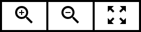
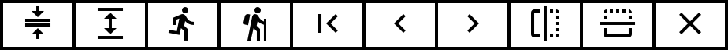

Manuals
=======

Control Panel
-------------

- Block diagram
- Block names
- Animated value and message connections
- On/off and homing
- Console

Behavior
--------

- Motion repertoire
- Shadow
- Attention span

Editor
------

- Dragging knots / control points 
- Drag for selecting knots
- Shift + Drag for horizontal scroll / zoom
- Double click for adding / removing knots
- Clicking for changing transport
- Space bar toggles playback

- Double click for renaming

Toolbar
^^^^^^^

   Undo and redo edits. Each action on the curve is auto saved and every curve
   has its own editing history.

   Zoom in and out. Reset viewport to see entire curve.

.. figure:: images/toolbar/3playback.png
   :alt: Playback and looping.
   :height: 32px
   :align: left

   Motion player selection. This controls on which motion player / motor set
   the curve is played. Playback control, motion recording and looping.

   Curve selection. Select which spline in the curve is shown. Remove and add
   new splines.

   Snap to grid, line continuity at knot, limit curve to motor range and live
   preview positions on the motor when moving knots.

   Actions: Scale, stretch, shift, flip and erase.

   Upload or download motion curves.
